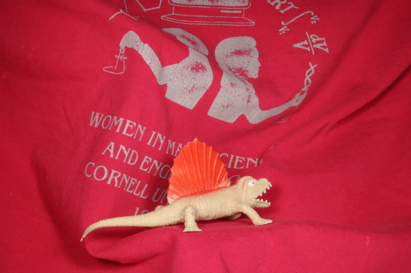

## Datasets

Datasets used to implement and test computer vision algorithms are in this directory.

### Middlebury 

Dataset downloaded from the [Middlebury Datasets](https://vision.middlebury.edu/flow/) 

* Dimetrodon

* RubberWhale

* Venus

### Synthesized

Dataset in this directory are synthesised locally.

* synth_data

