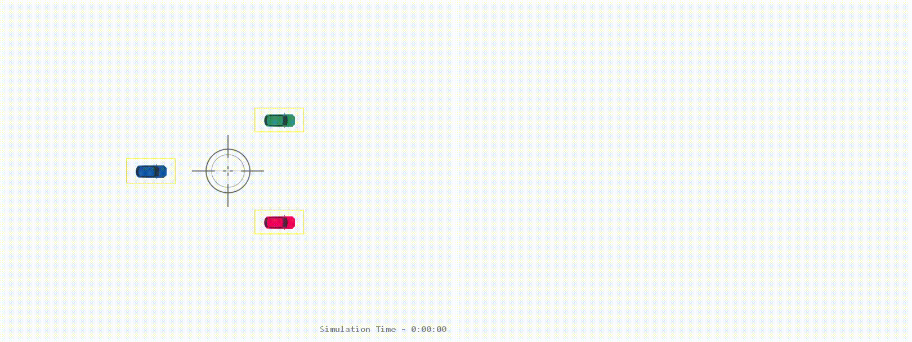

## Multi-Object Tracking

#### experiment MOT + ellipse

Controller is turned off. We start with three targets to track through occlusions. One of them performing lane changing maneuvers while the other two following a straight path. Parameters of the enclosing ellipse is computed and displayed in the tracking window.

