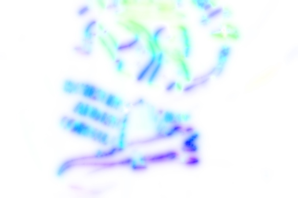
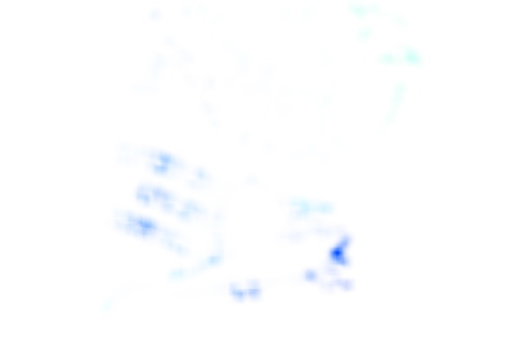
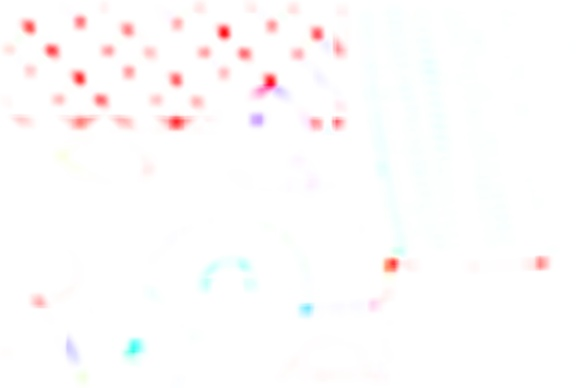

### Module usage by example

#### [horn_schunk](./horn_schunk.py)
```python
from horn_schunk import compute_optical_flow_HS

# ...
# read images 1 and 2
# set alpha and number of iterations
# (higher alpha enforces smoother flow field)
alpha = 0.5
num_iter = 128

# get optical flow
flow = u, v = compute_optical_flow_HS(img_1, img_2, alpha, num_iter)

# ...
```

#### horn_schunk results
<table>
    <tr>
        <td></td>
        <td></td>
        <td></td>
        <td></td>
    </tr>
</table>

#### [farneback](./farneback.py)
```python
from farneback import compute_optical_flow_farn

# ...
# read images 1 and 2, then preprocess
# set farneback parameters
PYR_SCALING_RATIO = 0.5         
PYR_NUM_LEVELS = 3
WINDOW_SIZE = 15
NUM_ITER = 3
POLY_NEIGHBORHOOD = 5
POLY_SIGMA = 1.1
OPERATION_FLAGS = 0

# create dictionary of farneback params
farneback_params = dict( pyr_scale=PYR_SCALING_RATIO,
                         levels=PYR_NUM_LEVELS,
                         winsize=WINDOW_SIZE,
                         iterations=NUM_ITER,
                         poly_n=POLY_NEIGHBORHOOD,
                         poly_sigma=POLY_SIGMA,
                         flags=OPERATION_FLAGS )

# get optical flow 
u, v = compute_optical_flow_farneback(img_1, img_2, farneback_params)

# ...
```

#### Farneback results
<table>
    <tr>
        <td></td>
        <td></td>
        <td></td>
        <td></td>
    </tr>
</table>